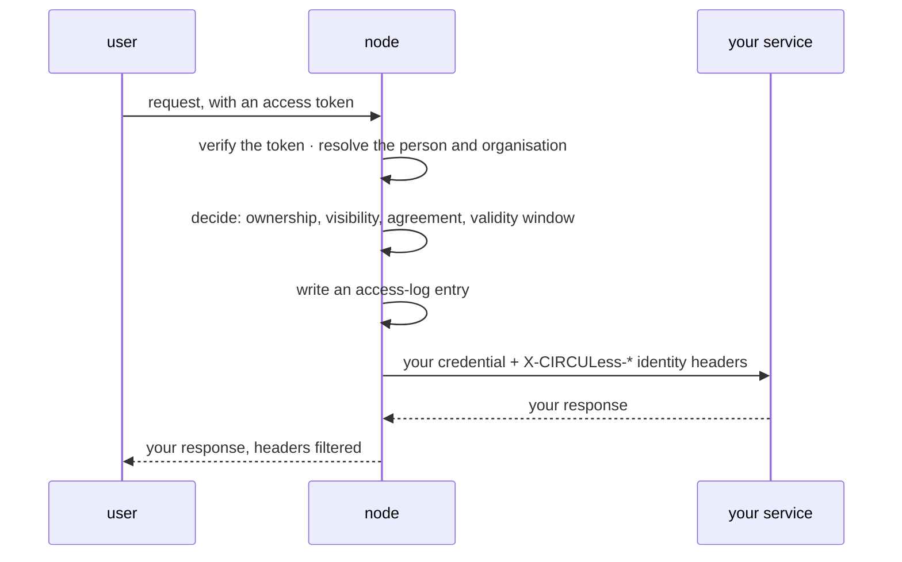

# Integrating a service with CIRCULess

Version 0.1 · Status: draft · Audience: partner developers

> Drafted here alongside the worked example in `examples/reference-service/`. Destined
> for the architecture repository as `service_integration_requirements.md`.

Normative language follows RFC 2119: **must**, **should**, **may**.

---

## 1. What a service is

A service is an HTTP API that a CIRCULess node calls on behalf of a user. The node
decides who may call it, the node records that the call happened, and the node holds the
credential it uses to reach you.

Your service is not a CIRCULess component and is not part of the platform's
architecture. It is a partner's system that the platform can reach under agreed terms.
This document is the whole contract between the two.

## 2. The short version

**If your API already requires an API key, it is already integrable. You change
nothing.**

Everything else in this document is either optional, a deployment matter, or a limit you
should know about before you meet it.

## 3. Tiers

| | what it is | what it costs you |
|---|---|---|
| **0** | an ordinary API with a credential. Reads no CIRCULess header | nothing |
| **1** | reads the caller's identity from request headers | about forty lines |
| **2** | correlates logs, paces polling, keeps redirects inside your endpoint | a handful of lines, each buying one thing |

### Tier 0

Your service **must** authenticate the caller — in practice, the node — and **must**
refuse a request without that credential. The node sends it on every call.

Your service **may** ignore every `X-CIRCULess-*` header. Every caller looks identical to
it. Deciding *which* callers are permitted is the node's job, not yours.

### Tier 1

Your service reads the caller's identity. It **must** still verify the credential first:
the headers are the node's word about who is calling, and they mean nothing on a request
that did not come from the node.

A service that acts on those headers **should** also be unreachable except from the node
— not instead of the credential, but behind it. At tier 0 the headers are ignored, so
there is nothing to forge; at tier 1 anyone holding the credential could also claim to
be anyone.

### Tier 2

Your service logs `X-CIRCULess-Request-Id`, sets `Retry-After` on asynchronous work, and
emits redirects that resolve inside its registered endpoint. Each is explained below.

## 4. The one service that cannot be tier 0

**A service that already requires an end-user OIDC token cannot work unmodified.**

The node removes the caller's `Authorization` header and substitutes your credential. The
user's token never reaches you — deliberately, because a token minted for a node and
handed to a third party could be replayed against that node as the user.

Such a service must move to tier 1: accept the node's credential, and take the user's
identity from the headers instead.

## 5. What happens before your service is called

Every hop is encrypted: TLS with certificates from a public CA on every publicly
reachable endpoint, and WireGuard on the overlay.

## 6. What your service receives

| header | |
|---|---|
| your credential | as you registered it: bearer, a named header, or basic |
| `X-CIRCULess-Subject` | a stable pseudonymous identifier for the person |
| `X-CIRCULess-Org` | the organisation they acted as for this call |
| `X-CIRCULess-Resource` | the identifier of your service's registration |
| `X-CIRCULess-Request-Id` | the node's identifier for this request, also in its log |
| `X-CIRCULess-Actor` | the client the token was issued to |

Forwarded from the caller, and nothing else: `Content-Type`, `Accept`,
`Content-Length`, `Idempotency-Key`. For a resource registered as streaming, also
`Mcp-Session-Id`, `Mcp-Protocol-Version` and `Last-Event-ID`.

**There is no name and no email.** Tokens issued for nodes carry neither, so there is
nothing for the node to pass on. A service that needs a display name must obtain it
some other way, with the person's knowledge.

Any `X-CIRCULess-*` header a caller sends is **removed** before your service sees it.
Those headers are always the node's word.

## 7. What your service must not do

### It must not authenticate the end user

The platform's identity provider issued the token, the node verified it, the node
checked the agreement and the node recorded the call. A service that repeats this will
either duplicate it badly or contradict it, and it does not have the information to do
it correctly.

### It must not fetch data from the node

Your service **must not** hold credentials for the node, and **must not** call back into
it.

A service that fetched data would be reading on *its own* authority rather than the
caller's. A user with no agreement could ask it to fetch something the service happens to
be permitted to see, and the agreement would stop being the thing that decides.

**The caller sends the bytes.** A client downloads a file from the node — an access that
is decided and logged against *them* — and posts it to your service in the request body.

## 8. Registering your service

### `endpoint_url`

The address the node will call.

It **must** be `http` or `https`. It **must not** resolve to a loopback address, to
`0.0.0.0`, or to link-local space — the node refuses these at registration and again on
every call, because a node's own internal interfaces live on loopback and link-local
addresses are where cloud providers expose credentials.

Private addresses are expected and permitted. Partner services normally live on a private
network.

A hostname is re-resolved on every call, so moving your service needs no re-registration.

### `invoke_policy`

| field | default | |
|---|---|---|
| `timeout_s` | 30 | deadline for a non-streaming call |
| `stream_timeout_s` | 300 | deadline while a stream is open |
| `idempotent_methods` | `GET, POST, HEAD, OPTIONS` | **the methods permitted at all**; anything else is refused before the node connects |
| `max_request_bytes` | 10485760 | largest request body relayed |
| `streaming` | false | relay unbuffered and forward the session headers |
| `async` | false | the service answers `202` and completes the work elsewhere |

`idempotent_methods` is an allowlist, not a retry list. **The node never retries.** A
dropped connection is reported to the caller as a failure.

### The credential

Set by an administrator of the organisation that owns the service registration, never by
an automated account. It is encrypted at rest and is returned by no interface at any
later point: to change it, set a new one.

Three forms, matching what services already do:

| scheme | what the node sends |
|---|---|
| `bearer` | `Authorization: Bearer <secret>` |
| `header` | `<your header name>: <secret>` |
| `basic` | `Authorization: Basic …`, username and password both encrypted |

A credential **must not** name `Host`, `Content-Length`, a hop-by-hop header, or any
`X-CIRCULess-*` header. The node asserts those itself.

## 9. Redirects

A redirect pointing inside your registered endpoint is rewritten to the node's own
address, so the caller follows it back through the node. A redirect pointing anywhere
else is **refused**: following it would take the caller out from behind the node, away
from the decision, the agreement and the log.

Your service **should** emit `Location` as a relative path with no leading slash —
`jobs/7`, not `/jobs/7`. The node resolves it against your registered `endpoint_url`. A
service registered at `https://host/api` that answers `/jobs/7` is pointing at
`https://host/jobs/7`, outside what was registered, and the redirect is refused.

Alternatively, register your `endpoint_url` at the root of your service, where
absolute paths resolve correctly.

## 10. Asynchronous work

Answer `202` with a `Location`. The node passes the status through unchanged and holds no
job state; the caller polls through the node.

Your service **should** set `Retry-After`. Every poll is a separate authorization
decision and a separate access-log entry. A client left to choose for itself may poll
several times a second.

Revoking an agreement stops an in-flight job at the next poll. A `202` is not a ticket
that outlives the permission that produced it.

## 11. Calling from an application

Three patterns. They differ in **whose identity reaches the node**, which decides what
the access log can tell you afterwards.

| | the node sees | maturity |
|---|---|---|
| **A** the browser calls the node | the person | in use |
| **B** your backend calls the node as itself | your application | supported; no configuration needed beyond a registered account |
| **C** your backend calls the node acting for the person | the person, with your application recorded alongside | designed and spiked; needs configuration per application; **not yet exercised end to end** |

**A is recommended** for anything a person initiates. The access log names them, and your
backend never handles another organisation's data.

**B is correct** for work your application genuinely does on its own behalf — a scheduled
run, a background job. It is the wrong choice for a user-facing action, because the log
will say your application did it, and the authorization decision will be made against
your application's organisation rather than the person's.

**C** is for a backend that must act for a person without a browser present. It uses
token exchange; the platform operator must configure it for your application, which is a
trust decision as well as a technical one.

### Tokens and audiences

A token is valid for **exactly one** audience. The platform rejects a token carrying more
than one, because a token accepted by two systems is replayable between them.

So an application that uses more than one API needs more than one token:

| what it does | audience |
|---|---|
| search the catalogue, handle agreements | the platform's control-plane audience |
| read, write or invoke on a node | that node's audience |

A second node means a third token.

**Obtain them with one sign-in.** Request every audience you need at sign-in, then
exchange the resulting refresh token for one access token per audience, narrowing the
requested scope each time. A refresh request cannot widen beyond what sign-in granted, so
anything you might need **must** be requested then.

**Discard the access token that sign-in returns.** It carries every audience you asked
for and is therefore rejected by all of them. Only the refresh token is useful.

Renewing by hidden iframe is not recommended: the identity provider is on another origin,
so it depends on third-party cookies, which browsers increasingly block.

Access tokens last five minutes. Hold the refresh token in memory, not in browser
storage.

### Serving an application's own interface

An application's pages and assets **must not** be served through the node. A browser
cannot attach a token to a page navigation, and every route on a node requires one.
Serve them from your own origin; only the data calls go to the node.

The operator of each node **must** add your origin to that node's list of permitted
browser origins before a browser can call it. Wildcards are not accepted.

## 12. One node at a time

A node serves only its own data. Nodes do not call one another, and no node will fetch
from another on a user's behalf.

Discovery is central — one catalogue lists everything, and each entry names the node that
holds it. Retrieval is not. An application that needs data from two nodes obtains a token
for each and fetches from each.

## 13. Limits

| | |
|---|---|
| request body through a service call | 10 MiB by default, configurable per service |
| access token lifetime | 5 minutes |
| retries | none; the node never retries a failed call |
| encryption at rest for stored data | not provided at this stage |

The 10 MiB bound follows from the caller sending the bytes. For larger data the planned
answer is a reference the node resolves itself, so the data never makes the round trip.
That does not exist yet, and this document will say so until it does.

## 14. Not yet demonstrated

Server-sent events. Nodes relay them unbuffered and forward the session headers for a
resource registered as streaming, but no integration has exercised this against a real
client.
